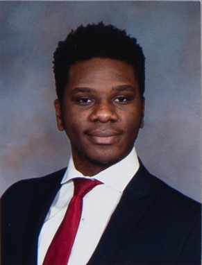

## Name: Elo Ekor ( eekor) - 
### email: ekore@.rpi.edu 
### github account: eloekor
### discord handle: Stormy12
Photo of Elo 

## Lab 01 Report - Introduction to Open Source Software

## Part 0. Photo of Discord !Discord(images/discord.jpg)

## Part 1.

## Name: Elo Ekor ( eekor) - 
### email: ekore@.rpi.edu 
### github account: eloekor
### discord handle: Stormy12
Photo of Elo 

## Part 2_3. Break down steps even when you believe the knowledge to be trivial. Be respectful and give proper attention to the askee. 

## Part 2_4. Upon reading chapter three of Free Culture, I grew very sympathetic to the injustice Jesse had to deal with. It exposed the very slippery slope that exists in regards to working with public technology and copyright laws. Growing up you always hear about not pirating movies or games or shows, but very infrequently are you educated on the true nature and reach of copyright laws. It was shocking to witness how drastically ones life could be affected by a combination of ignorance and misinformation. As this story of Jesse originates from 2002, I am now curious as to whether laws have been reformed in some way to offer more protection as open source has exploaded in popularity throughout the years. This piece defintely gives me the motivation and drive to learn more about the law in regards to working on open source projects and having a more fundamental understanding of what I can or can not do. 

## Part 3. Photo of Tree !Tree(images/tree.jpg)

## Part 4_1. Regular Expression Problems !Regex(images/regex.jpg)

## Part 4_2. Regular Expression Crosswords!RegexC(images/regex.jpg)

## Part 5. Snap !Snap(images/snap.jpg)

## Part 6. In order to determine a project that interests me, I have a few catgories to distingiush projects. First off the coding language in which the project is being written is of large importance to me. There are coding languages that I am comfortable with, others that I would be interested in learning, and finally some languages that I have no interest in touching. To be a fair evaluator and enjoy giving the evaluation, I would like to review a project with a language I am comfortable in. After thinking about language, I would then think about area of computer science the project would fall under and whether it would relate to data science, financial software, networking, or other core cs topics. After narrowing down the projects by that category, I would then be interested in seeing how many people have contributed to a project/understanding what phase it is in. This would allow me to properly gauge if the work I would review may be more inline with busywork or more impactful contributations.