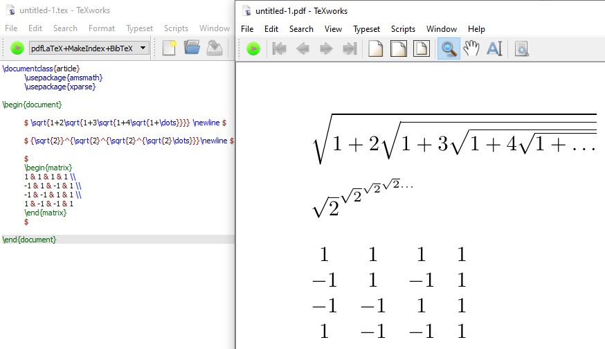

# Lab 03 Report - Documentation and Community

# 1
I would like to work on a project related to web-scraping and create an automated bot that will be used as a tool to buy items online qucikly. An existing open source project that relates to what I am planning to work on would be Open Supreme. This tool utilizes Python to check a website to see if an item is in stock, then procedes to sign into the website with a users profile information, and checkout the specific item in a second or less. The entire project is worked on in Python and I will likely also be utlizing this language but work to include a more intuitive, interactive GUI.

The goal of my project is to allow users to easily buy popular products online before they go out of stock. I will develop a more specialized idea of what type of product I would like to focus on obtaining whether it be sneakers, gaming consoles, or computer parts. For the project I have seen as a reference, users can only obtain items from the brand Supreme but I will try to allow users to scrape multiple sites for what they are trying to buy. 

###   

# 2
### Project - useCloudFS
### Number of Contributors - 2
### Lines of Code - 36,113  
### First Commit: Name: marinater, Date: September 15, 2020, Message: “Initial commit”  

### Last Commit: Name: marinater, Date: October 31, 2020 , Message: “ Merge pull request #33 from marinater/features/amplify-samarth Added demo app and tested autolinking”  

### Branches: development, master, famild, features/amplify-controller, features/amplify-search, features/amplify-controller2, features/amplify-controller4, features/firebase-controller

###   
Upon comparing my findings to gitstat, everything was the same: with two contriutors, same lines of code, and correct dates for the first and last commit.

###   

Project - Venue  
Number of Contributors - 16  
Lines of Code - 562,692  
Number of Branches - 54  
First Commit -    
- Name: tdurkin18  
- Date: October 1, 2019  
- Message: “Initial commit”  

Last Commit - 
- Name: TheStopsign  
- Date: December 30, 2020  
- Message: “redact numfor’s password”  
 
The lines of code and the number of contributors are different. Gitstats states that there are 61159 lines while Github states that there are 562,692 lines. Gitstats also states that there are 25 contributors while Github states that there are 16 contributors. 

Project - YACS  
Number of Contributors - 18    
Lines of Code - 44,600    
First Commit -    
- Name: jshom    
- Date: Feb 25, 2020  
- Message: “Initial commit”  

Last Commit - 
- Name: marchdan    
- Date: Feb 3, 2021  
- Message: “Update spring 2021 csv”    

Branches:
- 52-scheduling
- 280-loadPageSpinner
- 338-mobile-ui-revised
- add_vuex
- admin_panel_ui
- coursePage-recommendation
- create-pull-request/patch
- csv-fix
- dark-mode
- fixTimeSpring2021CSV
- page_for_department
- s21
- seo
- showDatabaseError
- shruti_yacs
- spring_2021_update
- subject_fail_reload
- summer2020-demo
- windows_support
- #230
- #259

Project - used_car_playground    
Number of Contributors - 6    
Lines of Code - 1,251,051    
First Commit -    
- Date: Dec 4, 2020  
- Message: “Update map.r”  

Last Commit - 
- Date: Nov 13, 2020  
- Message: “11/15 update”  

All branches: master, LOGO&backGround, selenium, song_xu_patch_1, bokehapp, data_analysis_on_maps  

TutorBase stats
12 contributors 
31562 lines of code 
newest commit by jweiss0 to merge branch "tutor-operations" (dec 10,2020) 
first commit by "DangItJason" on jun 5th 2020 
current branches are 
master, client-meetings,data-analysis,jacob.zamani/redux_refactor/navigation,jacob.zamani/scheduler
nicholas.arnold/new_scheduler,nicholas.arnold/redux_refactor,schedule-meeting,
thomas.arturi/login-redesign,thomas.arturi/react_schedule_selector,
tutor_settings_redux

Gitstats:
Project name
	TutorBase
Generated
	2021-02-15 13:28:15 (in 7 seconds)
Generator
	GitStats (version ad6df85), git version 2.25.1, gnuplot 5.2 patchlevel 8
Report Period
	2020-06-05 14:43:57 to 2020-12-10 12:19:39
Age
	189 days, 73 active days (38.62%)
Total Files
	133
Total Lines of Code
	24158 (88106 added, 63948 removed)
Total Commits
	183 (average 2.5 commits per active day, 1.0 per all days)
Authors
	13 (average 14.1 commits per author)
Gitstats seems to be much more thorough and I was definitely a little off in my analysis. I'm honestly suprised by how off my code count was, I used the command "git ls-files -z | xargs -0 wc -l" for my code and its suprising to see how far off it is.
