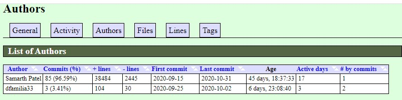
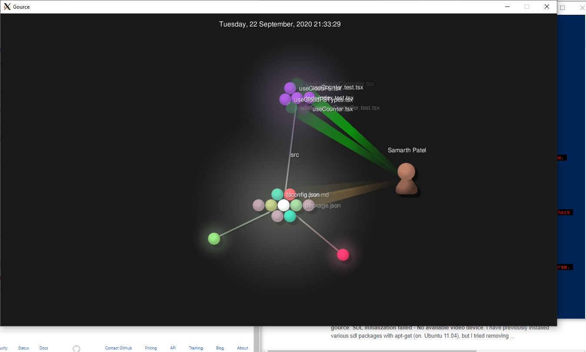

# Lab 03 Report - Documentation and Community

# 1
I would like to work on a project related to web-scraping and create an automated bot that will be used as a tool to buy items online qucikly. An existing open source project that relates to what I am planning to work on would be Open Supreme. This tool utilizes Python to check a website to see if an item is in stock, then procedes to sign into the website with a users profile information, and checkout the specific item in a second or less. The entire project is worked on in Python and I will likely also be utlizing this language but work to include a more intuitive, interactive GUI.

The goal of my project is to allow users to easily buy popular products online before they go out of stock. I will develop a more specialized idea of what type of product I would like to focus on obtaining whether it be sneakers, gaming consoles, or computer parts. For the project I have seen as a reference, users can only obtain items from the brand Supreme but I will try to allow users to scrape multiple sites for what they are trying to buy. 

### !Latex(Latex.jpg)  

# 2
### Project - useCloudFS
### Number of Contributors - 2
### Lines of Code - 36,113  
### First Commit: Name: marinater, Date: September 15, 2020, Message: “Initial commit”  

### Last Commit: Name: marinater, Date: October 31, 2020 , Message: “ Merge pull request #33 from marinater/features/amplify-samarth Added demo app and tested autolinking”  

### Branches: development, master, famild, features/amplify-controller, features/amplify-search, features/amplify-controller2, features/amplify-controller4, features/firebase-controller

###   
Upon comparing my findings to gitstat, everything was the same: with two contriutors, same lines of code, and correct dates for the first and last commit.

###   

