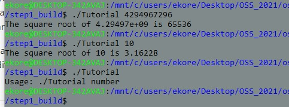
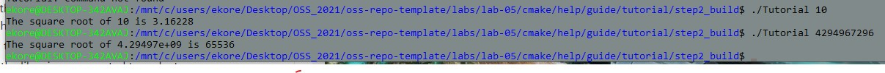
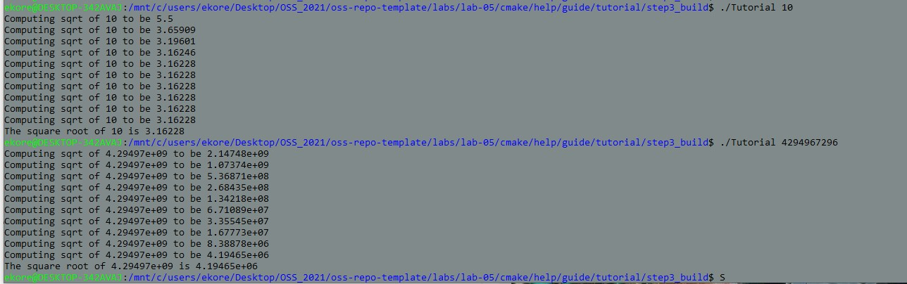
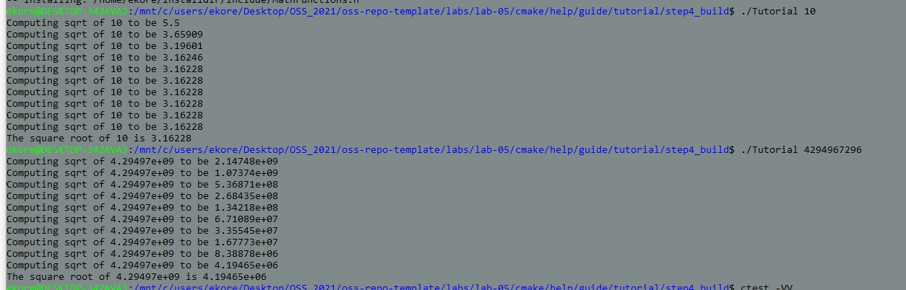
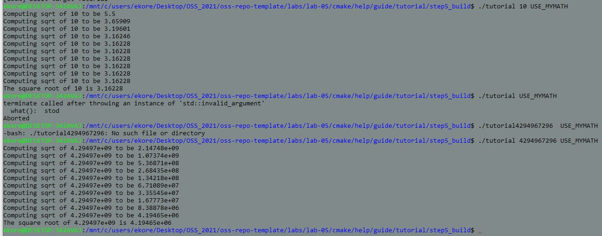

# Lab 05 Report - Build Systems

# 1
###  
[Modified tutorial.cxx](Step1/tutorial.cxx)
[CMakeLists.txt](Step1/CMakeLists.txt)

# 2
###  
[Modified tutorial.cxx](Step2/tutorial.cxx)
[CMakeLists.txt](Step2/CMakeLists.txt)

# 3
###  
[Modified Math Function](Step3/MathFunctions/CMakeLists.txt)
[CMakeLists.txt](Step2/CMakeLists.txt)

# 4
###  
###  
[Modified Math Function](Step4/MathFunctions/CMakeLists.txt)
[CMakeLists.txt](Step4/CMakeLists.txt)

#5
###  
[Modified Math Function](Step5/MathFunctions/CMakeLists.txt)
[CMakeLists.txt](Step5/CMakeLists.txt)
  