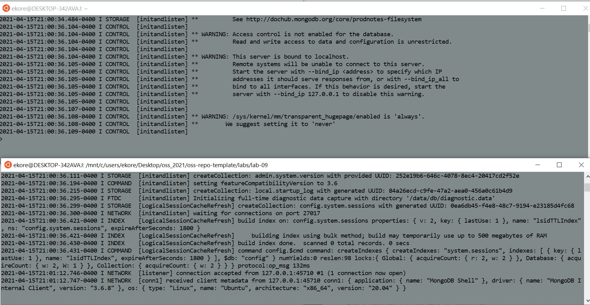
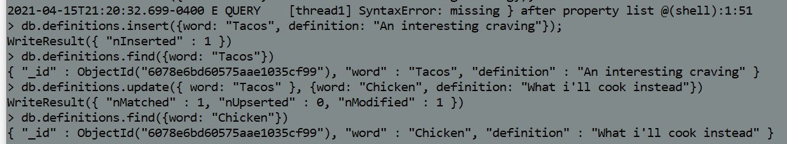
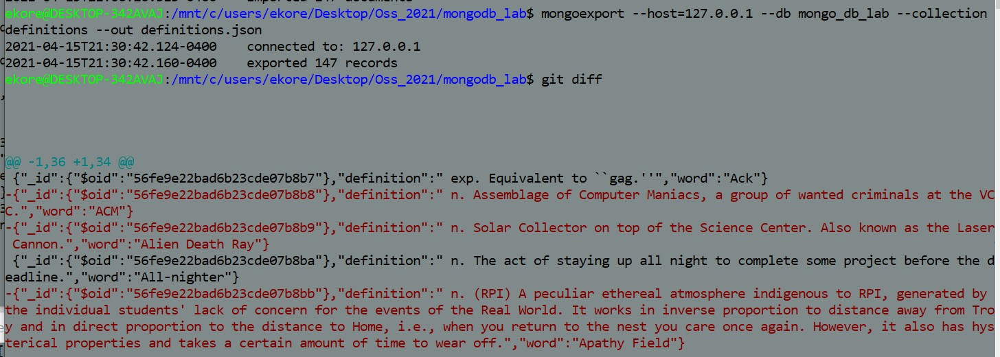
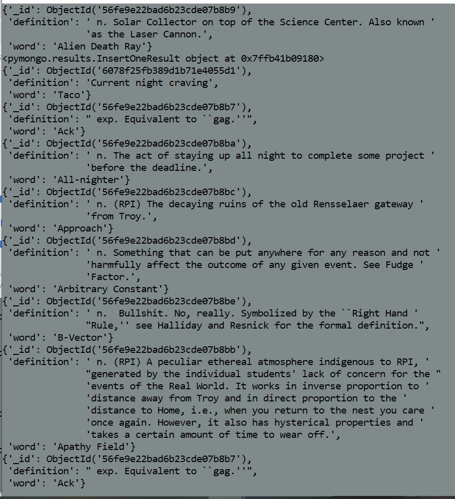
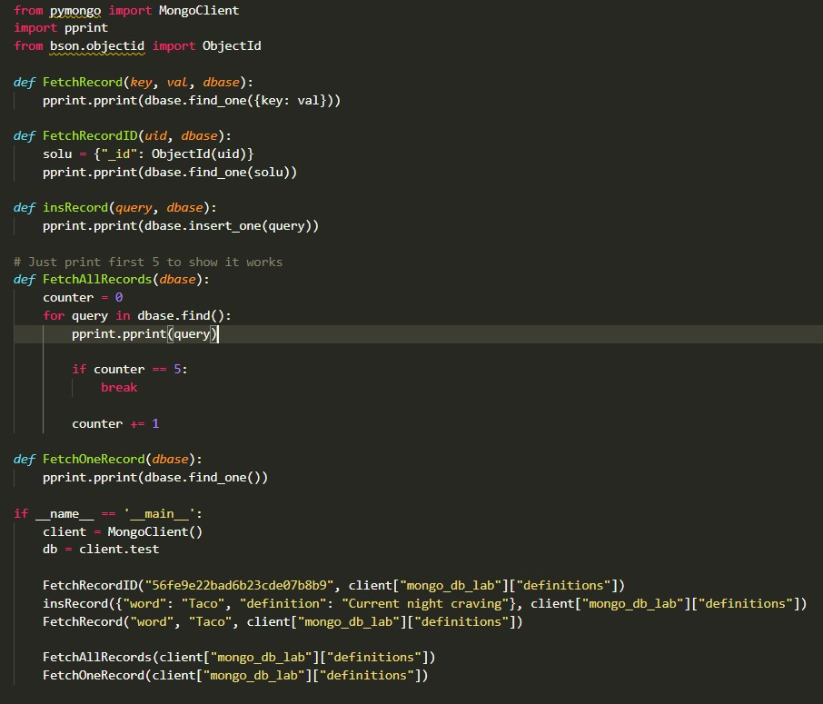

# Lab 9 Report - Databases

# 1

###  

# 2

###  

# 3

db.definitions.find() - query all objects with defintions variable 
db.definitions.findOne() - query first object with defintion variable
db.definitions.find({word: "Capitaland"}) - query object that includes Capitalland 
db.definitions.find({_id: ObjectId("56fe9e22bad6b23cde07b8ce")}) - query object based on unique id

###  
###  

# 4
###  
###  
