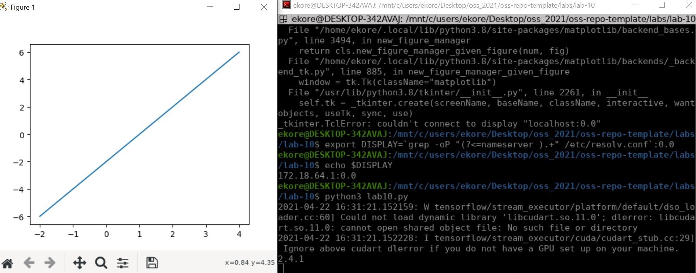
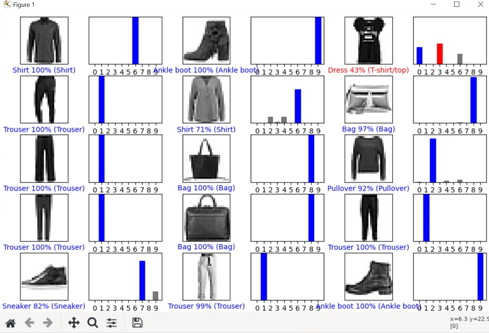
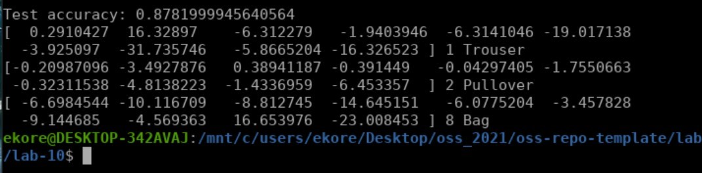

# Lab 10 Report - TensorFlow

# 1

###  

# 2

## Unmodified Code Solution
###  

## Modified Code Solution
###  

## Modified Code
###  

# 3

## Jeans
###  

## Sweatshirt
###  

## Sneakers
###  

## Results
2/3 results were correct, the only thing wrong was labeling the sneakers as a bag
### 

 

